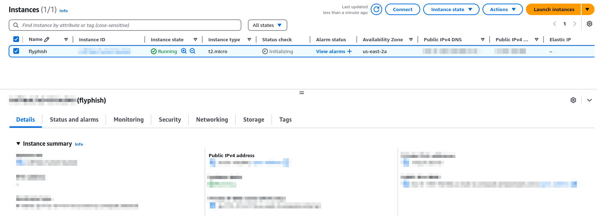
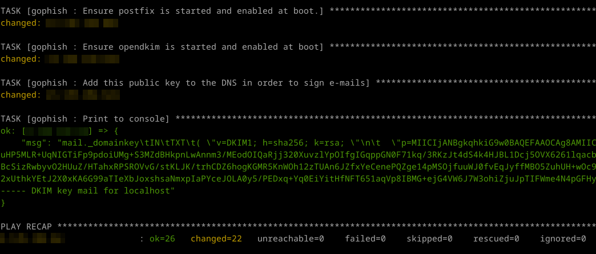
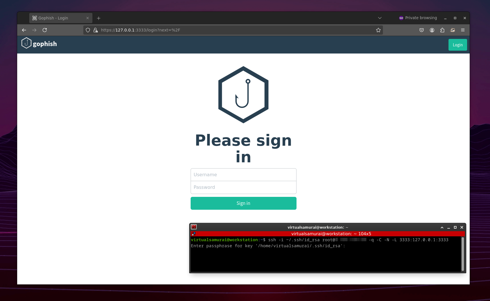

# Flyphish

Flyphish is an Ansible playbook allowing cyber security consultants to deploy a phishing server in the cloud for security assessments.

The playbook installs and configures **Gophish**, **Postfix** and **OpenDKIM** on a virtual machine in the cloud. Additionally, for OPSEC purposes, the playbook removes default IOCs (SMTP headers) from Gophish and Postfix servers configurations.

# Install

## Requirements

* Make sure you have a Linux (Debian, Ubuntu or Kali) instance in the cloud (Amazon EC2, Azure VM, Google GCE...) with a public IPv4 address. Install OpenSSH and enable root access with SSH key-based authentication only.



* Purchase a domain and set it's DNS records accordingly (A, MX and SPF records must point to your cloud instance's public IP address).

* Install Ansible on your own machine :

```
sudo apt install ansible
```


## Installation steps

* Clone the repository

```
git clone --recursively https://github.com/VirtualSamuraii/flyphish.git
```

* Put your cloud instance public IP address in the **hosts** file.

* Put your phishing domain in the **group_vars/all.yml** file.

You're ready to go !

# Usage

* Run the playbook and wait for your phishing server to be deployed :

```
ansible-playbook -i hosts playbook.yml
```

* Once finished, the playbook displays your DKIM public key. Add this key to your DKIM record in your domain's DNS zone.



The rest is up to you. 

From now on, you can log into your cloud instance using SSH, start your Gophish server and configure it to send signed emails from your Postfix SMTP server. 

# Tips 

* Avoid exposing your Gophish server on internet. You can access your Gophish UI on your local machine (https://127.0.0.1:3333) using SSH :

```
ssh -i ~/.ssh/id_rsa youruser@yourcloudinstance -q -C -N -L 3333:127.0.0.1:3333
```



* Most of the cloud services providers don't allow outbound traffic to SMTP port 25 for spamming reasons. Choose your provider wisely. 

# TODO

* Add an SMTP redirector role
* Add a RedELK role
* Maybe automate the cloud instance creation part using Terraform